# CSCE 435 Group project

## 0. Group number: 5

## 1. Group members:

1. Jared Wang
2. Kevin Tang
3. Aaron Matthews
4. Surya Jasper

- Communication via Slack

## 2. Project topic (e.g., parallel sorting algorithms)

### 2a. Brief project description (what algorithms will you be comparing and on what architectures)

- Bitonic Sort: SPMD (CPU)
- Sample Sort: SPMD (CPU)
- Merge Sort: SPMD (CPU)
- Radix Sort: SPMD (CPU)

### 2b. Pseudocode for each parallel algorithm
- For MPI programs, include MPI calls you will use to coordinate between processes

---

Bitonic Sort

```python
def parallel_bitonic_sort(arr):
    MPI_Init()
    rank = MPI_Comm_rank()   # Get the rank of the current process
    n_procs = MPI_Comm_size()   # Get the total number of processes

    # Divide array for parallel sorting
    local_arr = []
    if rank == 0:   
        # Divide & dispatch subarrays in host process  
        sub_arr_size = len(arr) // n_procs
        local_arr = arr[:sub_arr_size]
        for i in range(1, n_procs):
            worker_arr = arr[i * sub_arr_size : (i + 1) * sub_arr_size]
            MPI_Send(worker_arr, dest=i)
    else:   
        # Receive local subarray from host process in worker process
        local_arr = MPI_Recv(source=0)

    # Sort local subarrays into bitonically alternating pairs (ascending-descending-ascending-etc.) 
    if rank % 2 == 0:
        local_bitonic_sort(local_arr, 0, len(local_arr), ascending=True)
    else:
        local_bitonic_sort(local_arr, 0, len(local_arr), ascending=False)

    # Iteratively & parallelly merge bitonic pairs of locally sorted subarrays
    step = 1
    while step < n_procs:
        if rank % (step * 2) == 0:
            # Receive data from partner process and bitonic merge sort into local array
            recv_arr = MPI_Recv(source=rank + step)
            local_arr.extend(recv_arr)
            local_bitonic_merge(local_arr, 0, len(local_arr), True)
        else:
            # Send local array to process waiting to merge and exit
            MPI_Send(local_arr, dest=rank - step)
            break
        step = step * 2 # Double step for next iteration

    # Host process now contains fully-sorted array
    if rank == 0:
        print(local_arr)

    MPI_Finalize()

def local_bitonic_sort(arr, low, count, ascending):
    if count > 1:
        k = count // 2
        local_bitonic_sort(arr, low, k, True)        # Sort first half in ascending order
        local_bitonic_sort(arr, low + k, k, False)    # Sort second half in descending order
        local_bitonic_merge(arr, low, count, ascending) # Bitonic merge sorted halves

def local_bitonic_merge(arr, low, count, ascending):
    if count <= 1:
        return  # Break recursion on base case
    k = count // 2
    # Iteratively swap such that all elements in the first half are:
    #   - less than all elements in the second half if ascending
    #   - greater than all elements in the second half if descending
    for i in range(low, low + k):
        if arr[i] > arr[k + i] == ascending:
            swap(arr[i], arr[k + i])
    # Recursively merge each half to sort
    local_bitonic_merge(arr, low, k, ascending)
    local_bitonic_merge(arr, low + k, k, ascending)
```

---

Sample Sort

    // Note, generating data separately in each process could be more efficient, but due to the nature of sample sort and how the master process distributes the data to worker processes, I'm not sure whether this is possible
    // This function uses sample sort to sort the n element array A using s samples 
    function sample_sort(A, n, s):
        MPI_Init()
        rank = MPI_Comm_rank()
        // The number of worker processes is also the number of buckets
        num_processes = MPI_Comm_size()
        // For now, assume that n % num_processes = 0
        bucket_size = n/num_processes

        if rank == 0:
            // First, the master process needs to send data to the worker processes
            for i from 0 to num_processes - 1:
                MPI_Send(A[i:i*bucket_size], dest = i)

        else:
            // Worker process receives work from master process
            current_bucket = MPI_Recv(source=0)
            quicksort(current_bucket, current_bucket.size)
            local_samples = []
            // Choose s random values from current_bucket and add to local_samples
            for i from 1 to s:
                r = random(1, bucket_size)
                local_samples.add(current_bucket[r])
            MPI_Send(samples, dest = 0)

        if rank == 0:
            master_samples = []
            // Gather all local samples from each of the worker processes and combine into master_samples
            MPI_Gather(master_samples, MPI_Comm_World)
            quicksort(master_samples, master_samples.size)

            splitters = []
            // Choose num_processes - 1 values from master_samples randomly to be the splitters
            for i from 1 to num_processes - 1:
                splitter = master_samples[random(1, bucket_size)]
                local_samples.add(splitter)

            quicksort(splitters, splitters.size)
            // Split elements by bucket

            buckets = [][]
            for i from 0 to n:
                for j from 1 to num_processes - 1
                    if A[i] > splitters[j-1] && A[i] <= splitters[j]
                    # Put into the jth bucket
                    buckets[j].add(A[i])
            for i from 1 to num_processes:
                quicksort(buckets[i], buckets[i].size)

            # combine all buckets[i] into result
            return result

    // Sorts A recursively using quicksort
    function quicksort(A, n):
        // Choose the rightmost element as the pivot
        pivot = A[n-1]

        // elements in left will be less than or equal to A[pivot], elements in the right will be greater than or equal to A[pivot]
        left_size = 0
        left = []
        right_size = 0
        right = []
        for i from left to right, i not equal to pivot:
            if A[i] <= A[pivot]:
                left.add(A[i])
                left_size++
            else:
                right.add(A[i])
                right_size++
        sorted_left = quicksort(left, left_size) 
        sorted_right = quicksort(right, right_size)
        // Combine sorted_left with A[pivot] and sorted_right to create the final array result
        return result

---

Merge Sort

    def parallel_merge_sort(A, N):  
      MPI_Init()
      rank = MPI_Comm_rank()  # Get the rank of the current process
      size = MPI_Comm_size()   # Get the total number of processes
  
      # Divide the array among processes
      if rank == 0:
          sub_array_size = N // size  # Calculate the size of each sub-array
          # Send portions of the array to each process
          for i in range(1, size):
              # Sending sub-arrays to other processes
              MPI_Send(A[i * sub_array_size:(i + 1) * sub_array_size], dest=i)
          local_array = A[0:sub_array_size]  # Root keeps its portion of the array
      else:
          # Receive the assigned sub-array for non-root processes
          local_array = MPI_Recv(source=0)
  
      # Custom merge sort on the sub-array
      merge_sort(local_array)  # Each process sorts its own sub-array
  
      # Merging step using iterative merging (recursive doubling)
      step = 1  # Start with a step size of 1 for merging
      while step < size:  # Continue until the step size is greater than the number of processes
          if rank % (2 * step) == 0:  # Check if the process is an even-ranked process for merging
              if rank + step < size:  # Ensure there is a process to receive the data
                  # Receive the sorted sub-array from the partner process
                  received_array = MPI_Recv(source=rank + step)
                  # Merge the local sorted array with the received array
                  local_array = merge(local_array, received_array)
          else:
              # Send the local sorted array to the partner process
              MPI_Send(local_array, dest=rank - step)
              break  # Exit the loop after sending the data
          step *= 2  # Double the step size for the next iteration
  
      # Finalize MPI
      MPI_Finalize()  # Clean up the MPI environment before exiting

    def merge_sort(arr): 
       # Custom merge sort implementation 
       if len(arr) > 1:
          #define pointers
          mid = len(arr) // 2   # Find the midpoint of the array
          left = arr[:mid]      # Split the array into two halves
          right = arr[mid:]

          # Recursively sort the left and right halves
          merge_sort(left)
          merge_sort(right)

          # Merging the sorted halves back together
          i = j = k = 0  # Initialize indices for left, right, and merged arrays
          while i < len(left) and j < len(right):
              if left[i] < right[j]:  # Compare elements from both halves
                  arr[k] = left[i]     # Add the smaller element to the merged array
                  i += 1
              else:
                  arr[k] = right[j]    # Add the smaller element to the merged array
                  j += 1
              k += 1  # Move to the next position in the merged array

          # Add any remaining elements from the left half
          while i < len(left):
              arr[k] = left[i]
              i += 1
              k += 1

          # Add any remaining elements from the right half
          while j < len(right):
              arr[k] = right[j]
              j += 1
              k += 1

      return arr

---

Radix Sort

```python
def parallel_radix_sort(arr):
    comm = MPI.COMM_WORLD
    rank = comm.Get_rank()
    size = comm.Get_size()

    # chunk size and local chunk for each process
    chunk_size = len(arr) // size
    local_chunk = arr[rank * chunk_size: (rank + 1) * chunk_size]

    # step 1: count for local chunk -> Histogram
    max_value = comm.allreduce(np.max(local_chunk), op=MPI.MAX)
    num_buckets = int(np.log2(max_value)) + 1
    local_histogram = np.zeros((num_buckets, 256), dtype=int)

    for num in local_chunk:
        for byte_index in range(num_buckets):
            bucket = (num >> (byte_index * 8)) & 0xFF
            local_histogram[byte_index][bucket] += 1

    # step 2: partial sums
    global_histogram = np.zeros_like(local_histogram)
    comm.Reduce(local_histogram, global_histogram, op=MPI.SUM, root=0)

    if rank == 0:
        for i in range(num_buckets):
            np.cumsum(global_histogram[i], out=global_histogram[i])

    comm.Bcast(global_histogram, root=0)

    # step 3: reorder
    sorted_arr = np.zeros_like(arr)
    for byte_index in range(num_buckets):
        offsets = np.zeros(256, dtype=int)
        comm.Exscan(local_histogram[byte_index], offsets, op=MPI.SUM)
        
        for i, num in enumerate(local_chunk):
            bucket = (num >> (byte_index * 8)) & 0xFF
            index = offsets[bucket] + global_histogram[byte_index][bucket] - \
                    np.sum(local_histogram[byte_index][bucket+1:])
            sorted_arr[index] = num
            offsets[bucket] += 1

        comm.Allgather(local_chunk, arr)
        local_chunk = arr[rank * chunk_size: (rank + 1) * chunk_size]

    return sorted_arr
```

---

### 2c. Evaluation plan - what and how will you measure and compare
- Input sizes {2^16, 2^18, 2^20, 2^22, 2^24, 2^26, 2^28}
- Input types {Sorted, Random, Reverse sorted, 1%perturbed}
- Number of Processes {2, 4, 8, 16, 32, 64, 128, 256, 512, 1024}
- Strong scaling (same problem size, increase number of processors/nodes)
- Weak scaling (increase problem size, increase number of processors)

### 3a. Caliper instrumentation
Please use the caliper build `/scratch/group/csce435-f24/Caliper/caliper/share/cmake/caliper` 
(same as lab2 build.sh) to collect caliper files for each experiment you run.

Your Caliper annotations should result in the following calltree
(use `Thicket.tree()` to see the calltree):
```
main
|_ data_init_X      # X = runtime OR io
|_ comm
|    |_ comm_small
|    |_ comm_large
|_ comp
|    |_ comp_small
|    |_ comp_large
|_ correctness_check
```

Required region annotations:
- `main` - top-level main function.
    - `data_init_X` - the function where input data is generated or read in from file. Use *data_init_runtime* if you are generating the data during the program, and *data_init_io* if you are reading the data from a file.
    - `correctness_check` - function for checking the correctness of the algorithm output (e.g., checking if the resulting data is sorted).
    - `comm` - All communication-related functions in your algorithm should be nested under the `comm` region.
      - Inside the `comm` region, you should create regions to indicate how much data you are communicating (i.e., `comm_small` if you are sending or broadcasting a few values, `comm_large` if you are sending all of your local values).
      - Notice that auxillary functions like MPI_init are not under here.
    - `comp` - All computation functions within your algorithm should be nested under the `comp` region.
      - Inside the `comp` region, you should create regions to indicate how much data you are computing on (i.e., `comp_small` if you are sorting a few values like the splitters, `comp_large` if you are sorting values in the array).
      - Notice that auxillary functions like data_init are not under here.
    - `MPI_X` - You will also see MPI regions in the calltree if using the appropriate MPI profiling configuration (see **Builds/**). Examples shown below.

All functions will be called from `main` and most will be grouped under either `comm` or `comp` regions, representing communication and computation, respectively. You should be timing as many significant functions in your code as possible. **Do not** time print statements or other insignificant operations that may skew the performance measurements.

### **Nesting Code Regions Example** - all computation code regions should be nested in the "comp" parent code region as following:
```
CALI_MARK_BEGIN("comp");
CALI_MARK_BEGIN("comp_small");
sort_pivots(pivot_arr);
CALI_MARK_END("comp_small");
CALI_MARK_END("comp");

# Other non-computation code
...

CALI_MARK_BEGIN("comp");
CALI_MARK_BEGIN("comp_large");
sort_values(arr);
CALI_MARK_END("comp_large");
CALI_MARK_END("comp");
```

### **Calltree Example**:
```
# MPI Mergesort
4.695 main
├─ 0.001 MPI_Comm_dup
├─ 0.000 MPI_Finalize
├─ 0.000 MPI_Finalized
├─ 0.000 MPI_Init
├─ 0.000 MPI_Initialized
├─ 2.599 comm
│  ├─ 2.572 MPI_Barrier
│  └─ 0.027 comm_large
│     ├─ 0.011 MPI_Gather
│     └─ 0.016 MPI_Scatter
├─ 0.910 comp
│  └─ 0.909 comp_large
├─ 0.201 data_init_runtime
└─ 0.440 correctness_check
```

Calltree for Merge Sort:


Calltree for Bitonic Sort:


Calltree for Radx Sort:


Calltree for Sample Sort:


### 3b. Collect Metadata

Have the following code in your programs to collect metadata:
```
adiak::init(NULL);
adiak::launchdate();    // launch date of the job
adiak::libraries();     // Libraries used
adiak::cmdline();       // Command line used to launch the job
adiak::clustername();   // Name of the cluster
adiak::value("algorithm", algorithm); // The name of the algorithm you are using (e.g., "merge", "bitonic")
adiak::value("programming_model", programming_model); // e.g. "mpi"
adiak::value("data_type", data_type); // The datatype of input elements (e.g., double, int, float)
adiak::value("size_of_data_type", size_of_data_type); // sizeof(datatype) of input elements in bytes (e.g., 1, 2, 4)
adiak::value("input_size", input_size); // The number of elements in input dataset (1000)
adiak::value("input_type", input_type); // For sorting, this would be choices: ("Sorted", "ReverseSorted", "Random", "1_perc_perturbed")
adiak::value("num_procs", num_procs); // The number of processors (MPI ranks)
adiak::value("scalability", scalability); // The scalability of your algorithm. choices: ("strong", "weak")
adiak::value("group_num", group_number); // The number of your group (integer, e.g., 1, 10)
adiak::value("implementation_source", implementation_source); // Where you got the source code of your algorithm. choices: ("online", "ai", "handwritten").
```

They will show up in the `Thicket.metadata` if the caliper file is read into Thicket.

Metadata for Merge Sort:

| algorithm | programming_model | data_type | size_of_data_type | input_size | input_type | num_procs | scalability | group_num | implementation_source |
|-----------|-------------------|-----------|--------------------|------------|-------------|-----------|--------------|-----------|----------------------|
| merge     | mpi               | int       | 4                  | 65536      | Random      | 2         | strong       | 5         | handwritten          |
| merge     | mpi               | int       | 4                  | 65536      | Random      | 4         | strong       | 5         | handwritten          |
| merge     | mpi               | int       | 4                  | 65536      | Random      | 8         | strong       | 5         | handwritten          |
| merge     | mpi               | int       | 4                  | 65536      | Random      | 16        | strong       | 5         | handwritten          |
| merge     | mpi               | int       | 4                  | 65536      | Random      | 32        | strong       | 5         | handwritten          |
| merge     | mpi               | int       | 4                  | 65536      | Random      | 64        | strong       | 5         | handwritten          |
| merge     | mpi               | int       | 4                  | 65536      | Random      | 128       | strong       | 5         | handwritten          |
| merge     | mpi               | int       | 4                  | 65536      | Random      | 256       | strong       | 5         | handwritten          |
| merge     | mpi               | int       | 4                  | 65536      | Random      | 512       | strong       | 5         | handwritten          |
| merge     | mpi               | int       | 4                  | 65536      | Random      | 1024      | strong       | 5         | handwritten          |
| merge     | mpi               | int       | 4                  | 262144     | Random      | 2         | strong       | 5         | handwritten          |
| merge     | mpi               | int       | 4                  | 262144     | Random      | 4         | strong       | 5         | handwritten          |
| merge     | mpi               | int       | 4                  | 262144     | Random      | 8         | strong       | 5         | handwritten          |
| merge     | mpi               | int       | 4                  | 262144     | Random      | 16        | strong       | 5         | handwritten          |
| merge     | mpi               | int       | 4                  | 262144     | Random      | 32        | strong       | 5         | handwritten          |
| merge     | mpi               | int       | 4                  | 262144     | Random      | 64        | strong       | 5         | handwritten          |
| merge     | mpi               | int       | 4                  | 262144     | Random      | 128       | strong       | 5         | handwritten          |
| merge     | mpi               | int       | 4                  | 262144     | Random      | 256       | strong       | 5         | handwritten          |
| merge     | mpi               | int       | 4                  | 262144     | Random      | 512       | strong       | 5         | handwritten          |
| merge     | mpi               | int       | 4                  | 262144     | Random      | 1024      | strong       | 5         | handwritten          |
| merge     | mpi               | int       | 4                  | 1048576    | Random      | 2         | strong       | 5         | handwritten          |
| merge     | mpi               | int       | 4                  | 1048576    | Random      | 4         | strong       | 5         | handwritten          |
| merge     | mpi               | int       | 4                  | 1048576    | Random      | 8         | strong       | 5         | handwritten          |
| merge     | mpi               | int       | 4                  | 1048576    | Random      | 16        | strong       | 5         | handwritten          |
| merge     | mpi               | int       | 4                  | 1048576    | Random      | 32        | strong       | 5         | handwritten          |
| merge     | mpi               | int       | 4                  | 1048576    | Random      | 64        | strong       | 5         | handwritten          |
| merge     | mpi               | int       | 4                  | 1048576    | Random      | 128       | strong       | 5         | handwritten          |
| merge     | mpi               | int       | 4                  | 1048576    | Random      | 256       | strong       | 5         | handwritten          |
| merge     | mpi               | int       | 4                  | 1048576    | Random      | 512       | strong       | 5         | handwritten          |
| merge     | mpi               | int       | 4                  | 1048576    | Random      | 1024      | strong       | 5         | handwritten          |
| merge     | mpi               | int       | 4                  | 4194304    | Random      | 2         | strong       | 5         | handwritten          |
| merge     | mpi               | int       | 4                  | 4194304    | Random      | 4         | strong       | 5         | handwritten          |
| merge     | mpi               | int       | 4                  | 4194304    | Random      | 8         | strong       | 5         | handwritten          |
| merge     | mpi               | int       | 4                  | 4194304    | Random      | 16        | strong       | 5         | handwritten          |
| merge     | mpi               | int       | 4                  | 4194304    | Random      | 32        | strong       | 5         | handwritten          |
| merge     | mpi               | int       | 4                  | 4194304    | Random      | 64        | strong       | 5         | handwritten          |
| merge     | mpi               | int       | 4                  | 4194304    | Random      | 128       | strong       | 5         | handwritten          |
| merge     | mpi               | int       | 4                  | 4194304    | Random      | 256       | strong       | 5         | handwritten          |
| merge     | mpi               | int       | 4                  | 4194304    | Random      | 512       | strong       | 5         | handwritten          |
| merge     | mpi               | int       | 4                  | 4194304    | Random      | 1024      | strong       | 5         | handwritten          |
| merge     | mpi               | int       | 4                  | 16777216   | Random      | 2         | strong       | 5         | handwritten          |
| merge     | mpi               | int       | 4                  | 16777216   | Random      | 4         | strong       | 5         | handwritten          |
| merge     | mpi               | int       | 4                  | 16777216   | Random      | 8         | strong       | 5         | handwritten          |
| merge     | mpi               | int       | 4                  | 16777216   | Random      | 16        | strong       | 5         | handwritten          |
| merge     | mpi               | int       | 4                  | 16777216   | Random      | 32        | strong       | 5         | handwritten          |
| merge     | mpi               | int       | 4                  | 16777216   | Random      | 64        | strong       | 5         | handwritten          |
| merge     | mpi               | int       | 4                  | 16777216   | Random      | 128       | strong       | 5         | handwritten          |
| merge     | mpi               | int       | 4                  | 16777216   | Random      | 256       | strong       | 5         | handwritten          |
| merge     | mpi               | int       | 4                  | 16777216   | Random      | 512       | strong       | 5         | handwritten          |
| merge     | mpi               | int       | 4                  | 16777216   | Random      | 1024      | strong       | 5         | handwritten          |
| merge     | mpi               | int       | 4                  | 67108864   | Random      | 2         | strong       | 5         | handwritten          |
| merge     | mpi               | int       | 4                  | 67108864   | Random      | 4         | strong       | 5         | handwritten          |
| merge     | mpi               | int       | 4                  | 67108864   | Random      | 8         | strong       | 5         | handwritten          |
| merge     | mpi               | int       | 4                  | 67108864   | Random      | 16        | strong       | 5         | handwritten          |
| merge     | mpi               | int       | 4                  | 67108864   | Random      | 32         | strong       | 5         | handwritten          |
| merge     | mpi               | int       | 4                  | 67108864   | Random      | 64         | strong       | 5         | handwritten          |
| merge     | mpi               | int       | 4                  | 67108864   | Random      | 128       | strong       | 5         | handwritten          |
| merge     | mpi               | int       | 4                  | 67108864   | Random      | 256       | strong       | 5         | handwritten          |
| merge     | mpi               | int       | 4                  | 67108864   | Random      | 512       | strong       | 5         | handwritten          |
| merge     | mpi               | int       | 4                  | 67108864   | Random      | 1024      | strong       | 5         | handwritten          |
| merge     | mpi               | int       | 4                  | 268435456  | Random      | 2         | strong       | 5         | handwritten          |
| merge     | mpi               | int       | 4                  | 268435456  | Random      | 4         | strong       | 5         | handwritten          |
| merge     | mpi               | int       | 4                  | 268435456  | Random      | 8         | strong       | 5         | handwritten          |
| merge     | mpi               | int       | 4                  | 268435456  | Random      | 16        | strong       | 5         | handwritten          |
| merge     | mpi               | int       | 4                  | 268435456  | Random      | 32         | strong       | 5         | handwritten          |
| merge     | mpi               | int       | 4                  | 268435456  | Random      | 64         | strong       | 5         | handwritten          |
| merge     | mpi               | int       | 4                  | 268435456  | Random      | 128       | strong       | 5         | handwritten          |
| merge     | mpi               | int       | 4                  | 268435456  | Random      | 256       | strong       | 5         | handwritten          |
| merge     | mpi               | int       | 4                  | 268435456  | Random      | 512       | strong       | 5         | handwritten          |

Metadata for Bitonic Sort:

| algorithm   | programming_model   | data_type   |   size_of_data_type |   input_size | input_type   |   num_procs | scalability   |   group_num | implementation_source   |
|:------------|:--------------------|:------------|--------------------:|-------------:|:-------------|------------:|:--------------|------------:|:------------------------|
| bitonic   | mpi               | int       | 4                  |  268435456 | Random      |       128 | strong       |          5 | handwritten         |
| bitonic   | mpi               | int       | 4                  |    4194304 | Random      |       256 | strong       |          5 | handwritten         |
| bitonic   | mpi               | int       | 4                  |    1048576 | Random      |        16 | strong       |          5 | handwritten         |
| bitonic   | mpi               | int       | 4                  |      65536 | Random      |         4 | strong       |          5 | handwritten         |
| bitonic   | mpi               | int       | 4                  |   16777216 | Random      |       256 | strong       |          5 | handwritten         |
| bitonic   | mpi               | int       | 4                  |    1048576 | Random      |        32 | strong       |          5 | handwritten         |
| bitonic   | mpi               | int       | 4                  |     262144 | Random      |       256 | strong       |          5 | handwritten         |
| bitonic   | mpi               | int       | 4                  |    1048576 | Random      |        64 | strong       |          5 | handwritten         |
| bitonic   | mpi               | int       | 4                  |    4194304 | Random      |      1024 | strong       |          5 | handwritten         |
| bitonic   | mpi               | int       | 4                  |   16777216 | Random      |         2 | strong       |          5 | handwritten         |
| bitonic   | mpi               | int       | 4                  |   16777216 | Random      |      1024 | strong       |          5 | handwritten         |
| bitonic   | mpi               | int       | 4                  |  268435456 | Random      |      1024 | strong       |          5 | handwritten         |
| bitonic   | mpi               | int       | 4                  |     262144 | Random      |       128 | strong       |          5 | handwritten         |
| bitonic   | mpi               | int       | 4                  |   16777216 | Random      |         8 | strong       |          5 | handwritten         |
| bitonic   | mpi               | int       | 4                  |  268435456 | Random      |       512 | strong       |          5 | handwritten         |
| bitonic   | mpi               | int       | 4                  |    1048576 | Random      |       256 | strong       |          5 | handwritten         |
| bitonic   | mpi               | int       | 4                  |    4194304 | Random      |       128 | strong       |          5 | handwritten         |
| bitonic   | mpi               | int       | 4                  |      65536 | Random      |        64 | strong       |          5 | handwritten         |
| bitonic   | mpi               | int       | 4                  |      65536 | Random      |      1024 | strong       |          5 | handwritten         |
| bitonic   | mpi               | int       | 4                  |  268435456 | Random      |       256 | strong       |          5 | handwritten         |
| bitonic   | mpi               | int       | 4                  |   67108864 | Random      |       256 | strong       |          5 | handwritten         |
| bitonic   | mpi               | int       | 4                  |  268435456 | Random      |         8 | strong       |          5 | handwritten         |
| bitonic   | mpi               | int       | 4                  |   67108864 | Random      |       512 | strong       |          5 | handwritten         |
| bitonic   | mpi               | int       | 4                  |     262144 | Random      |         8 | strong       |          5 | handwritten         |
| bitonic   | mpi               | int       | 4                  |   67108864 | Random      |      1024 | strong       |          5 | handwritten         |
| bitonic   | mpi               | int       | 4                  |   16777216 | Random      |         4 | strong       |          5 | handwritten         |
| bitonic   | mpi               | int       | 4                  |   67108864 | Random      |         2 | strong       |          5 | handwritten         |
| bitonic   | mpi               | int       | 4                  |     262144 | Random      |         4 | strong       |          5 | handwritten         |
| bitonic   | mpi               | int       | 4                  |     262144 | Random      |        64 | strong       |          5 | handwritten         |
| bitonic   | mpi               | int       | 4                  |    1048576 | Random      |         2 | strong       |          5 | handwritten         |
| bitonic   | mpi               | int       | 4                  |     262144 | Random      |        16 | strong       |          5 | handwritten         |
| bitonic   | mpi               | int       | 4                  |    4194304 | Random      |         2 | strong       |          5 | handwritten         |
| bitonic   | mpi               | int       | 4                  |   67108864 | Random      |        64 | strong       |          5 | handwritten         |
| bitonic   | mpi               | int       | 4                  |  268435456 | Random      |        16 | strong       |          5 | handwritten         |
| bitonic   | mpi               | int       | 4                  |   67108864 | Random      |         8 | strong       |          5 | handwritten         |
| bitonic   | mpi               | int       | 4                  |     262144 | Random      |       512 | strong       |          5 | handwritten         |
| bitonic   | mpi               | int       | 4                  |    4194304 | Random      |        64 | strong       |          5 | handwritten         |
| bitonic   | mpi               | int       | 4                  |  268435456 | Random      |         4 | strong       |          5 | handwritten         |
| bitonic   | mpi               | int       | 4                  |   67108864 | Random      |        32 | strong       |          5 | handwritten         |
| bitonic   | mpi               | int       | 4                  |      65536 | Random      |       256 | strong       |          5 | handwritten         |
| bitonic   | mpi               | int       | 4                  |    1048576 | Random      |      1024 | strong       |          5 | handwritten         |
| bitonic   | mpi               | int       | 4                  |      65536 | Random      |         8 | strong       |          5 | handwritten         |
| bitonic   | mpi               | int       | 4                  |   16777216 | Random      |        16 | strong       |          5 | handwritten         |
| bitonic   | mpi               | int       | 4                  |      65536 | Random      |        16 | strong       |          5 | handwritten         |
| bitonic   | mpi               | int       | 4                  |   16777216 | Random      |       512 | strong       |          5 | handwritten         |
| bitonic   | mpi               | int       | 4                  |    1048576 | Random      |         8 | strong       |          5 | handwritten         |
| bitonic   | mpi               | int       | 4                  |    4194304 | Random      |         4 | strong       |          5 | handwritten         |
| bitonic   | mpi               | int       | 4                  |  268435456 | Random      |        64 | strong       |          5 | handwritten         |
| bitonic   | mpi               | int       | 4                  |   16777216 | Random      |        32 | strong       |          5 | handwritten         |
| bitonic   | mpi               | int       | 4                  |   16777216 | Random      |        64 | strong       |          5 | handwritten         |
| bitonic   | mpi               | int       | 4                  |   67108864 | Random      |         4 | strong       |          5 | handwritten         |
| bitonic   | mpi               | int       | 4                  |    1048576 | Random      |       128 | strong       |          5 | handwritten         |
| bitonic   | mpi               | int       | 4                  |    4194304 | Random      |        32 | strong       |          5 | handwritten         |
| bitonic   | mpi               | int       | 4                  |     262144 | Random      |        32 | strong       |          5 | handwritten         |
| bitonic   | mpi               | int       | 4                  |      65536 | Random      |         2 | strong       |          5 | handwritten         |
| bitonic   | mpi               | int       | 4                  |   67108864 | Random      |       128 | strong       |          5 | handwritten         |
| bitonic   | mpi               | int       | 4                  |   67108864 | Random      |        16 | strong       |          5 | handwritten         |
| bitonic   | mpi               | int       | 4                  |      65536 | Random      |       128 | strong       |          5 | handwritten         |
| bitonic   | mpi               | int       | 4                  |  268435456 | Random      |         2 | strong       |          5 | handwritten         |
| bitonic   | mpi               | int       | 4                  |      65536 | Random      |        32 | strong       |          5 | handwritten         |
| bitonic   | mpi               | int       | 4                  |     262144 | Random      |      1024 | strong       |          5 | handwritten         |
| bitonic   | mpi               | int       | 4                  |    1048576 | Random      |         4 | strong       |          5 | handwritten         |
| bitonic   | mpi               | int       | 4                  |  268435456 | Random      |        32 | strong       |          5 | handwritten         |
| bitonic   | mpi               | int       | 4                  |   16777216 | Random      |       128 | strong       |          5 | handwritten         |
| bitonic   | mpi               | int       | 4                  |    1048576 | Random      |       512 | strong       |          5 | handwritten         |
| bitonic   | mpi               | int       | 4                  |     262144 | Random      |         2 | strong       |          5 | handwritten         |
| bitonic   | mpi               | int       | 4                  |      65536 | Random      |       512 | strong       |          5 | handwritten         |
| bitonic   | mpi               | int       | 4                  |    4194304 | Random      |         8 | strong       |          5 | handwritten         |
| bitonic   | mpi               | int       | 4                  |    4194304 | Random      |        16 | strong       |          5 | handwritten         |
| bitonic   | mpi               | int       | 4                  |    4194304 | Random      |       512 | strong       |          5 | handwritten         |

Metadata for Radix Sort:

| algorithm | programming_model | data_type | size_of_data_type | input_size | input_type | num_procs | scalability | group_num | implementation_source |
|---|---|---|---|---|---|---|---|---|----|
| radix | mpi | int | 4 | 65536 | Random | 1024 | strong | 5 | handwritten |
| radix | mpi | int | 4 | 65536 | Random |  512 | strong | 5 | handwritten |
| radix | mpi | int | 4 | 65536 | Random |  256 | strong | 5 | handwritten |
| radix | mpi | int | 4 | 65536 | Random |  128 | strong | 5 | handwritten |
| radix | mpi | int | 4 | 65536 | Random |   64 | strong | 5 | handwritten |
| radix | mpi | int | 4 | 65536 | Random |   32 | strong | 5 | handwritten |
| radix | mpi | int | 4 | 65536 | Random |   16 | strong | 5 | handwritten |
| radix | mpi | int | 4 | 65536 | Random |    8 | strong | 5 | handwritten |
| radix | mpi | int | 4 | 65536 | Random |    4 | strong | 5 | handwritten |
| radix | mpi | int | 4 | 65536 | Random |    2 | strong | 5 | handwritten |
| radix | mpi | int | 4 | 262144 | Random | 1024 | strong | 5 | handwritten |
| radix | mpi | int | 4 | 262144 | Random |  512 | strong | 5 | handwritten |
| radix | mpi | int | 4 | 262144 | Random |  256 | strong | 5 | handwritten |
| radix | mpi | int | 4 | 262144 | Random |  128 | strong | 5 | handwritten |
| radix | mpi | int | 4 | 262144 | Random |   64 | strong | 5 | handwritten |
| radix | mpi | int | 4 | 262144 | Random |   32 | strong | 5 | handwritten |
| radix | mpi | int | 4 | 262144 | Random |   16 | strong | 5 | handwritten |
| radix | mpi | int | 4 | 262144 | Random |    8 | strong | 5 | handwritten |
| radix | mpi | int | 4 | 262144 | Random |    4 | strong | 5 | handwritten |
| radix | mpi | int | 4 | 262144 | Random |    2 | strong | 5 | handwritten |
| radix | mpi | int | 4 | 1048576 | Random | 1024 | strong | 5 | handwritten |
| radix | mpi | int | 4 | 1048576 | Random |  512 | strong | 5 | handwritten |
| radix | mpi | int | 4 | 1048576 | Random |  256 | strong | 5 | handwritten |
| radix | mpi | int | 4 | 1048576 | Random |  128 | strong | 5 | handwritten |
| radix | mpi | int | 4 | 1048576 | Random |   64 | strong | 5 | handwritten |
| radix | mpi | int | 4 | 1048576 | Random |   32 | strong | 5 | handwritten |
| radix | mpi | int | 4 | 1048576 | Random |   16 | strong | 5 | handwritten |
| radix | mpi | int | 4 | 1048576 | Random |    8 | strong | 5 | handwritten |
| radix | mpi | int | 4 | 1048576 | Random |    4 | strong | 5 | handwritten |
| radix | mpi | int | 4 | 1048576 | Random |    2 | strong | 5 | handwritten |
| radix | mpi | int | 4 | 4194304 | Random | 1024 | strong | 5 | handwritten |
| radix | mpi | int | 4 | 4194304 | Random |  512 | strong | 5 | handwritten |
| radix | mpi | int | 4 | 4194304 | Random |  256 | strong | 5 | handwritten |
| radix | mpi | int | 4 | 4194304 | Random |  128 | strong | 5 | handwritten |
| radix | mpi | int | 4 | 4194304 | Random |   64 | strong | 5 | handwritten |
| radix | mpi | int | 4 | 4194304 | Random |   32 | strong | 5 | handwritten |
| radix | mpi | int | 4 | 4194304 | Random |   16 | strong | 5 | handwritten |
| radix | mpi | int | 4 | 4194304 | Random |    8 | strong | 5 | handwritten |
| radix | mpi | int | 4 | 4194304 | Random |    4 | strong | 5 | handwritten |
| radix | mpi | int | 4 | 4194304 | Random |    2 | strong | 5 | handwritten |
| radix | mpi | int | 4 | 16777216 | Random | 1024 | strong | 5 | handwritten |
| radix | mpi | int | 4 | 16777216 | Random |  512 | strong | 5 | handwritten |
| radix | mpi | int | 4 | 16777216 | Random |  256 | strong | 5 | handwritten |
| radix | mpi | int | 4 | 16777216 | Random |  128 | strong | 5 | handwritten |
| radix | mpi | int | 4 | 16777216 | Random |   64 | strong | 5 | handwritten |
| radix | mpi | int | 4 | 16777216 | Random |   32 | strong | 5 | handwritten |
| radix | mpi | int | 4 | 16777216 | Random |   16 | strong | 5 | handwritten |
| radix | mpi | int | 4 | 16777216 | Random |    8 | strong | 5 | handwritten |
| radix | mpi | int | 4 | 16777216 | Random |    4 | strong | 5 | handwritten |
| radix | mpi | int | 4 | 16777216 | Random |    2 | strong | 5 | handwritten |
| radix | mpi | int | 4 | 67108864 | Random | 1024 | strong | 5 | handwritten |
| radix | mpi | int | 4 | 67108864 | Random |  512 | strong | 5 | handwritten |
| radix | mpi | int | 4 | 67108864 | Random |  256 | strong | 5 | handwritten |
| radix | mpi | int | 4 | 67108864 | Random |  128 | strong | 5 | handwritten |
| radix | mpi | int | 4 | 67108864 | Random |   64 | strong | 5 | handwritten |
| radix | mpi | int | 4 | 67108864 | Random |   32 | strong | 5 | handwritten |
| radix | mpi | int | 4 | 67108864 | Random |   16 | strong | 5 | handwritten |
| radix | mpi | int | 4 | 67108864 | Random |    8 | strong | 5 | handwritten |
| radix | mpi | int | 4 | 67108864 | Random |    4 | strong | 5 | handwritten |
| radix | mpi | int | 4 | 67108864 | Random |    2 | strong | 5 | handwritten |
| radix | mpi | int | 4 | 268435456 | Random | 1024 | strong | 5 | handwritten |
| radix | mpi | int | 4 | 268435456 | Random |  512 | strong | 5 | handwritten |
| radix | mpi | int | 4 | 268435456 | Random |  256 | strong | 5 | handwritten |
| radix | mpi | int | 4 | 268435456 | Random |  128 | strong | 5 | handwritten |
| radix | mpi | int | 4 | 268435456 | Random |   64 | strong | 5 | handwritten |
| radix | mpi | int | 4 | 268435456 | Random |   32 | strong | 5 | handwritten |
| radix | mpi | int | 4 | 268435456 | Random |   16 | strong | 5 | handwritten |
| radix | mpi | int | 4 | 268435456 | Random |    8 | strong | 5 | handwritten |
| radix | mpi | int | 4 | 268435456 | Random |    4 | strong | 5 | handwritten |
| radix | mpi | int | 4 | 268435456 | Random |    2 | strong | 5 | handwritten |

Metadata for sample sort:

| algorithm | programming_model | data_type | size_of_data_type | input_size | input_type | num_procs | scalability | group_num	| implementation_source |
|---|---|---|---|---|---|---|---|---|---|
| sample	| mpi | int |	4	|65536|	Random|	64	|strong	|5	|handwritten|
|	sample	|mpi	|int|	4	|65536|	Random	|2	|strong	|5	|handwritten|
|	sample	|mpi	|int|	4	|65536	|Random	|8	|strong	|5	|handwritten|
|	sample|mpi	|int|	4	|65536	|Random	|16	|strong	|5	|handwritten|
|sample|mpi|int|4|65536|Random|4|strong|5|handwritten|
|sample|mpi|int|4|65536|Random|32|strong|5|handwritten|
|sample|mpi|int|4|65536|Random|128|strong|5|handwritten|


### **See the `Builds/` directory to find the correct Caliper configurations to get the performance metrics.** They will show up in the `Thicket.dataframe` when the Caliper file is read into Thicket.
## 4. Performance evaluation

Include detailed analysis of computation performance, communication performance. 
Include figures and explanation of your analysis.

### 4a. Vary the following parameters
For input_size's:
- 2^16, 2^18, 2^20, 2^22, 2^24, 2^26, 2^28

For input_type's:
- Sorted, Random, Reverse sorted, 1%perturbed

MPI: num_procs:
- 2, 4, 8, 16, 32, 64, 128, 256, 512, 1024

This should result in 4x7x10=280 Caliper files for your MPI experiments.

### 4b. Hints for performance analysis

To automate running a set of experiments, parameterize your program.

- input_type: "Sorted" could generate a sorted input to pass into your algorithms
- algorithm: You can have a switch statement that calls the different algorithms and sets the Adiak variables accordingly
- num_procs: How many MPI ranks you are using

When your program works with these parameters, you can write a shell script 
that will run a for loop over the parameters above (e.g., on 64 processors, 
perform runs that invoke algorithm2 for Sorted, ReverseSorted, and Random data).  

### 4c. You should measure the following performance metrics
- `Time`
    - Min time/rank
    - Max time/rank
    - Avg time/rank
    - Total time
    - Variance time/rank

#### Bitonic Sort Plots:


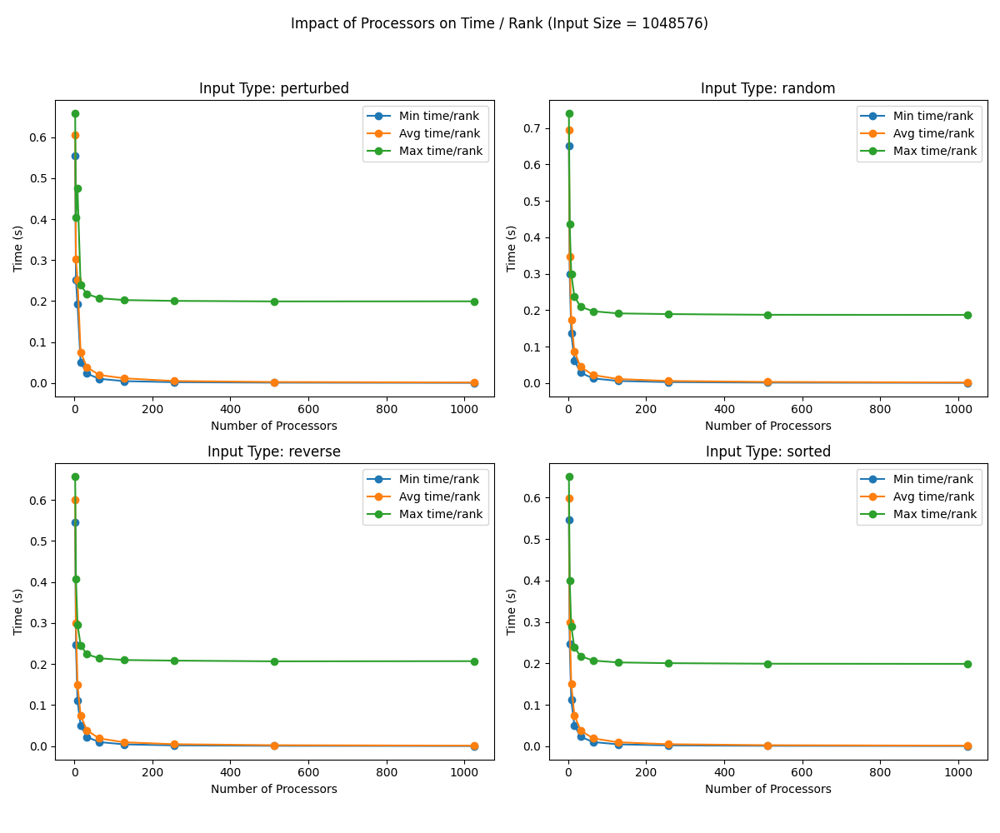

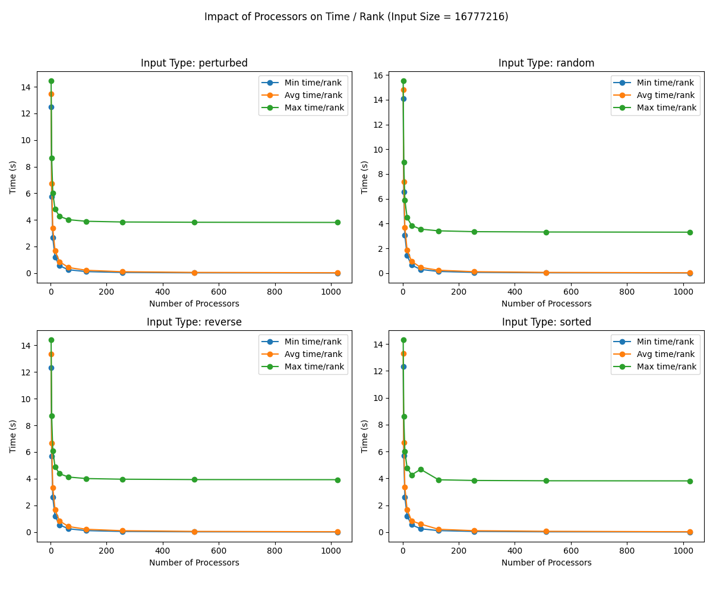

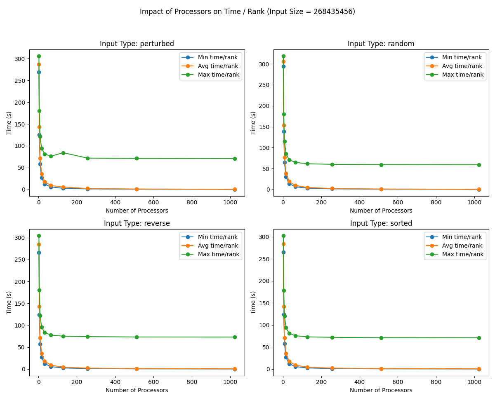
As we can see from the plots, the computation time by rank scales down negative exponentially as expected when we scale up the number of processors. This is because the bitonic sort implementation recursively divides the computational load between processors such that each only has to manage an even subarray. 

We also see that as we increase the input size, the exponential speedup by number of processes is maintained, while our total time does increase. This is expected as greater array sizes means increased computational costs per processor, additional memory allocation, and more data that needs to be communicated between processes. 

Another good indication is that the variance in computational time between processes likewise displays an exponential decay as we ramp up the number of processors. This is good news as it indicates this approach is evenly distributing the workload among processors. The key factor in this is the parallel merging algorithm I implemented that utilizes partner processes to hierarchically merge the locally sorted subarrays, trickling up into the master process's final sorted array.

Overall, the scalability of this approach is definitely quite strong as we ramp up the number of processors and exponentiate our input size, but there is definitely still room for improvement on cutting down communication costs and complexities.

---

#### Radix Sort Plots:


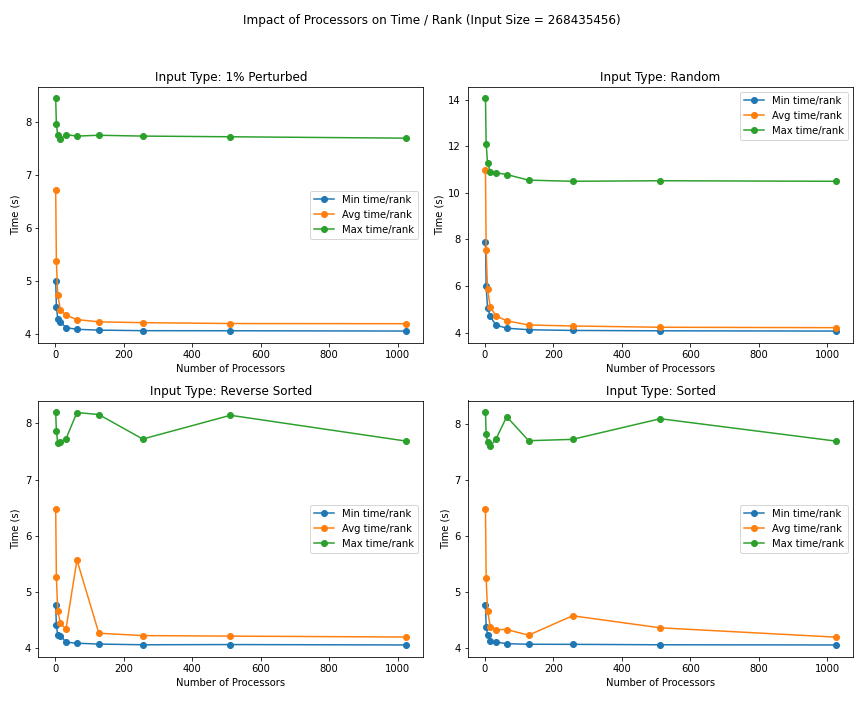

Generally speaking, we can see that the computation time of radix sort follows a negative exponential trend as the number of processors increase. However, the time difference between the varying number of processors are not as significant as others, nor is the trendline. This is because radix sort is more of a counting sort, performing linearly rather than logarithmically. Still, the trend follows this negative exponential curve since the increasing number of processors allow for smaller chunk sizes for each processor.

When looking at the total time, we can clearly see that there is a extreme positive linear relationship between the total time and number of processors for every input size. This indicates a weak scaling algorithm because as you add more processors and increase the problem size proportionally, the computation time should ideally remain stable or increase only slightly due to communication overhead.

#### Merge Sort Plots:
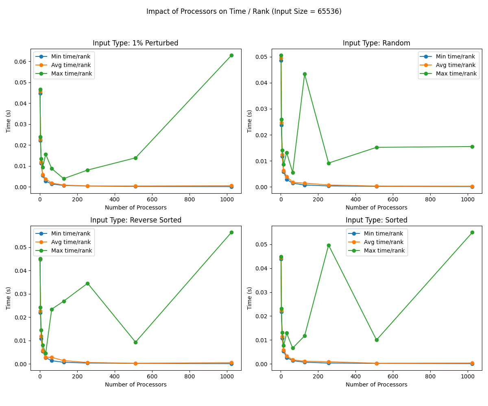


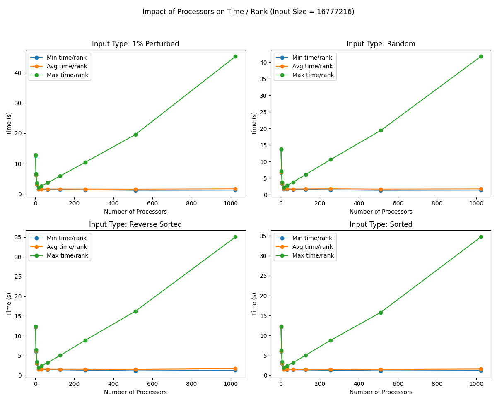
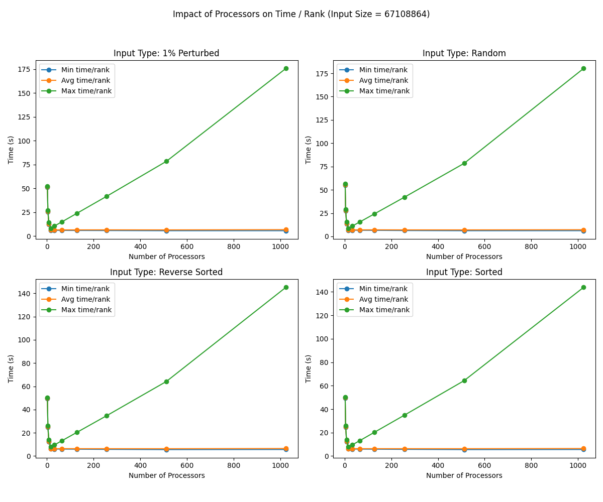
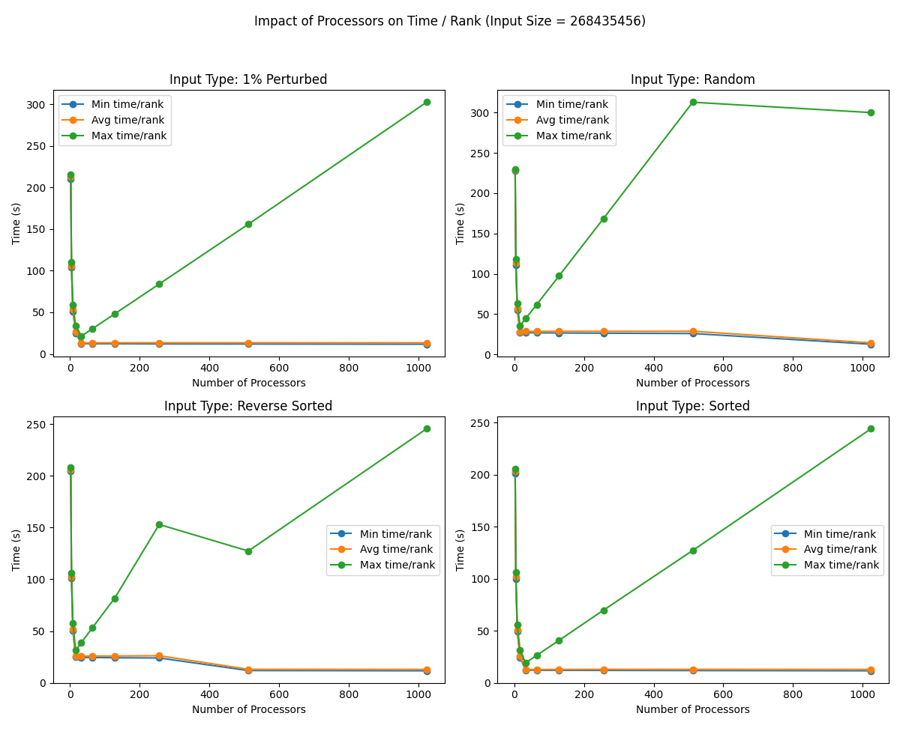

As the number of processes increases, the computational time decreases exponentially with respect to the number of processors.  Conceptually, this makes sense because merge sort is a divide-and-conquer sorting algorithm.  When there are more processors and the computational workload is distributed evenly, individual processors will do less computational work.

#### Sample Sort Plots:
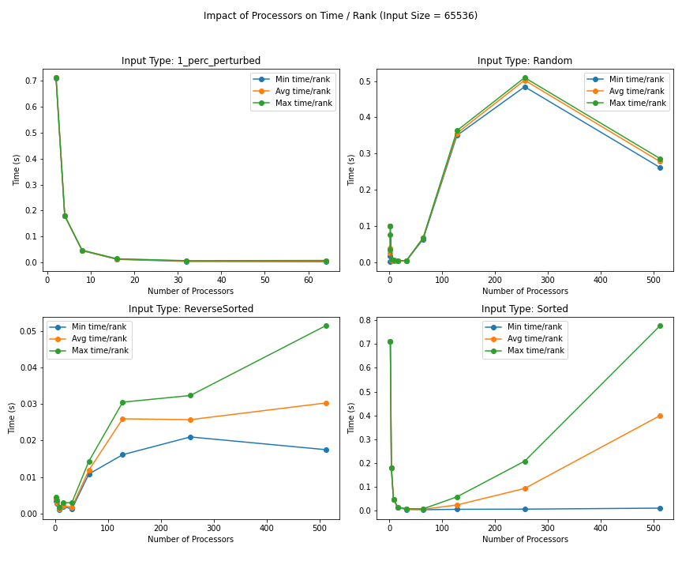


The algorithm still times out and takes much longer than expected for large numbers of processes and/or sorted or perturbed input values. This along with some network issues and other possibly related errors caused a lot of jobs to not run and the data to look unexpected. On the other hand, some plots look sort of reasonable such as the plot for 2^16 for perturbed and sorted. These feature an exponentially decreasing function which seems reasonable. These unexpected trends will hopefully be fixed with a new revision of the sample sort implementation.

## 5. Presentation
Plots for the presentation should be as follows:
- For each implementation:
    - For each of comp_large, comm, and main:
        - Strong scaling plots for each input_size with lines for input_type (7 plots - 4 lines each)
        - Strong scaling speedup plot for each input_type (4 plots)
        - Weak scaling plots for each input_type (4 plots)

Analyze these plots and choose a subset to present and explain in your presentation.

- Strong Scaling Speedup Plot Analysis:
    - General Trends: According to Amdahl's law, as the problem size increases, the portion of the algorithm that can be parallelized becomes more significant relative to the non-parallelizable part. Therefore, with larger datasets, the benefits of parallel execution become more pronounced, leading to better speedup ratios.  This explain why the speedup improves with respect to input sizes.  However, as the number of processors increases beyond a certain point, diminishing returns in speedup gains can occur. This is primarily due to the increasing communication overhead that becomes more dominant relative to the workload that can be effectively parallelized. While this trend applies to most algorithms, Bitonic Sort may not experience the same level of diminishing returns due to its fixed communication patterns, which do not scale efficiently with the addition of processors.
    - Merge Sort:
        - Random:
          
           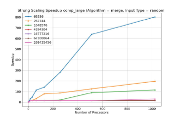
           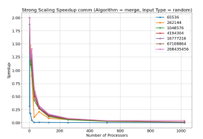 <br> 
              comp_large: Shows the best speedup, as its divide-and-conquer strategy efficiently distributes workload across processors. This leads to nearly ideal scaling for large problem sizes. <br> <br>
              comm: Shows exponential decay in speedup as the number of processors increases.  Merge Sort’s structured merging phase involves data exchange between processors. As the problem size is split across more processors, the merging step requires more frequent communication.  Initially, more processors reduce overall computation time, but the communication overhead during merging grows. This causes a decline in speedup because processors spend more time synchronizing.  The sharp speedup decay occurs when the communication cost outweighs the gains from parallelizing the computation.
    - Sample Sort:
        - Random:
          
           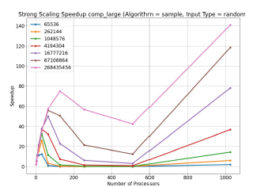
           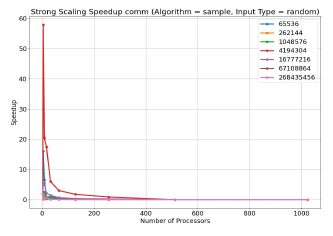 <br> 
              comp_large: Also achieves good speedup, especially for randomized array inputs, as it adjusts how it divides the data dynamically (adaptive partitioning). This ensures that each processor gets an equal share of the workload, avoiding situations where some processors finish early and others take longer (load imbalance). By balancing the work more evenly, Sample Sort performs strongly in parallel computing, particularly when dealing with large datasets, as it reduces idle time and maximizes the efficiency of all processors involved. <br> <br>
              comm: Also shows exponential decay in speedup, similar to Merge Sort, as the number of processors increases.  Sample Sort’s adaptive partitioning involves significant communication, especially when redistributing elements across processors. While this ensures balanced workload, it also introduces communication overhead.  As more processors are added, the overhead grows due to the need for more frequent data exchanges to maintain balanced partitions. This results in diminishing speedup, where adding processors reduces the benefit gained from parallelism.  Unlike Merge Sort, which benefits from structured merging, Sample Sort's partitioning introduces additional communication steps, causing its speedup to decay slightly faster than Merge Sort's.  
    - Bitonic Sort:
        - Random:
          
           
           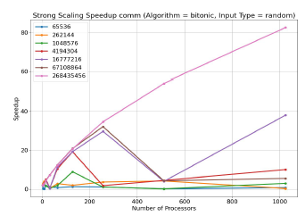 <br> 
          comp_large: Shows slow speedup due to its fixed communication patterns.  The relationship between speedup and the number of processors is linear.  As the number of processors increases, Bitonic sort doesn’t scale as efficiently, particularly for random inputs.  This is because Bitonic sort follows a rigid comparison-and-swapping routine, regardless of the data structure. For random inputs, this leads to excessive and unnecessary comparison checks, meaning it does not utilize parallelism the best. <br> <br>
          comm: Shows a curved increase in communication speedup as the number of processors increases. Unlike Merge or Sample Sort, where communication overhead becomes more dominant, Bitonic Sort maintains a steady, though not ideal, increase in speedup.  Bitonic Sort's fixed communication structure means that while communication grows with more processors, it doesn't become a significant bottleneck. This results in a moderate increase in communication speedup, which indicates that communication costs do not degrade the algorithm's performance as quickly as in algorithms like Radix or Sample Sort.
    - Radix Sort:
        - Random:
          
           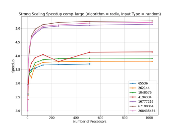
           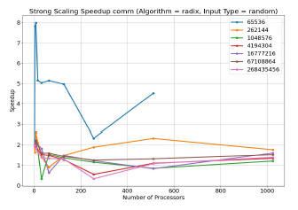 <br>
              - comp_large: Shows the weakest speedup.  Since Radix sort is a non-comparative sorting algorithm, it lacks the flexibility of divide-and-conquer approach. The same number of passes is required, limiting its ability to benefit from added processors.  On top of that, Radix sort requires inter-processor communication to coordinate and distribute data for every pass. As input size increases, this overhead becomes more dominating, which further reduces speedup gains. <br> <br>
              - comm: Exhibits exponential decay in communication speedup, although more mildly than sample and merge sort.  Unlike comparison-based algorithms, Radix Sort sorts numbers digit by digit, processing each digit from the least significant to the most significant, which leads to more predictable and efficient communication patterns. T he use of Counting Sort as a subroutine is pivotal, as counting Sort operates in linear time, allowing Radix Sort to maintain effective data handling with reduced communication overhead.  Each digit's sorting can be parallelized by distributing the work across multiple processors, where each processor independently counts occurrences in its assigned subarray, minimizing inter-processor communication. Although communication costs do increase with larger input sizes, primarily due to the need for coordination and redistribution of counts, these costs remain lower than the merging overhead seen in algorithms like Merge and Sample Sort, as communication primarily involves aggregating and redistributing counts rather than exchanging individual data elements, which reduces the frequency and complexity of data transfers.  
      
- Weak Scaling Plot Analysis:

## 6. Final Report
Submit a zip named `TeamX.zip` where `X` is your team number. The zip should contain the following files:
- Algorithms: Directory of source code of your algorithms.
- Data: All `.cali` files used to generate the plots seperated by algorithm/implementation.
- Jupyter notebook: The Jupyter notebook(s) used to generate the plots for the report.
- Report.md
